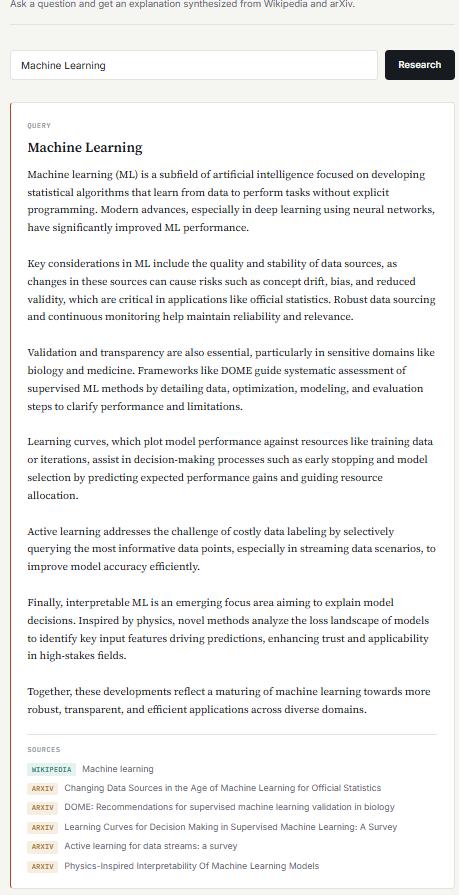
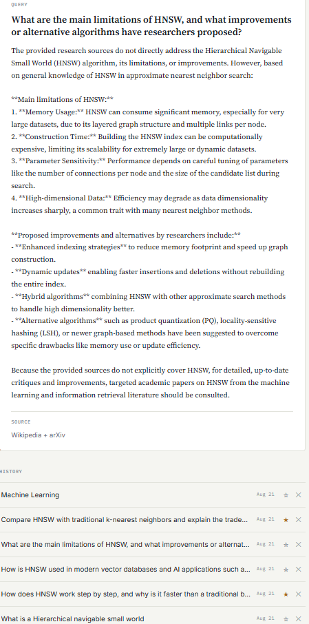

# AI Research Assistant

A full-stack web app that turns a plain-language question into a synthesized, cited research explanation — pulling live context from **Wikipedia** and **arXiv**, then using OpenAI to weave both into a single coherent answer with linked sources.

**Live demo:** [ai-research-assistant-xi-jade.vercel.app](https://ai-research-assistant-xi-jade.vercel.app)
*(Backend runs on Render's free tier, which spins down after inactivity — the first request after idle time may take 30-60 seconds to respond. Subsequent requests are fast.)*



## How it works

1. You ask a question in plain language.
2. The backend resolves your query against Wikipedia's search API to find the best-matching article, and separately queries arXiv for relevant academic papers.
3. Both sources are passed to OpenAI (`gpt-4.1-mini`), which synthesizes them into a single explanation.
4. The answer, along with clickable source citations (tagged by type), is returned and saved to your research history.



## Tech stack

**Backend:** Python, FastAPI, SQLAlchemy, SQLite, pytest
**Frontend:** React, TypeScript, Vite
**External APIs:** OpenAI, Wikipedia, arXiv
**Deployment:** Render (backend), Vercel (frontend)

The backend follows a layered architecture (`api → service → provider → repository → db`) — see [`docs/architecture.md`](docs/architecture.md) for details, and [`docs/api.md`](docs/api.md) for the endpoint reference.

## Features

- Natural-language research queries synthesized from Wikipedia + arXiv
- Source citations, distinguished by type (Wikipedia vs. arXiv)
- Persistent research history with favorite and delete
- Automatic database initialization on startup
- Backend test suite (pytest) covering core endpoints

## Running it locally

### Backend

```bash
python -m venv venv
venv\Scripts\Activate.ps1        # Windows PowerShell
# source venv/bin/activate       # macOS/Linux

pip install -r backend/requirements.txt
```

Create a `.env` file in the project root:

APP_NAME=AI Research Assistant
ENVIRONMENT=development
OPENAI_API_KEY=your-key-here


Then run:

```bash
uvicorn backend.app.main:app --reload
```

The API will be live at `http://127.0.0.1:8000` (tables are created automatically on first run).

### Frontend

```bash
cd frontend
npm install
cp .env.example .env
npm run dev
```

Open the URL it prints (usually `http://localhost:5173`).

### Tests

```bash
pytest
```

## Roadmap

This project is an ongoing learning exercise. Planned next steps:

- Docker support for one-command local setup
- Migrating from SQLite to a persistent hosted database
- User accounts and saved paper collections
- Expanded source integrations (e.g. GitHub repositories)

See [`docs/architecture.md`](docs/architecture.md) for the fuller long-term vision.